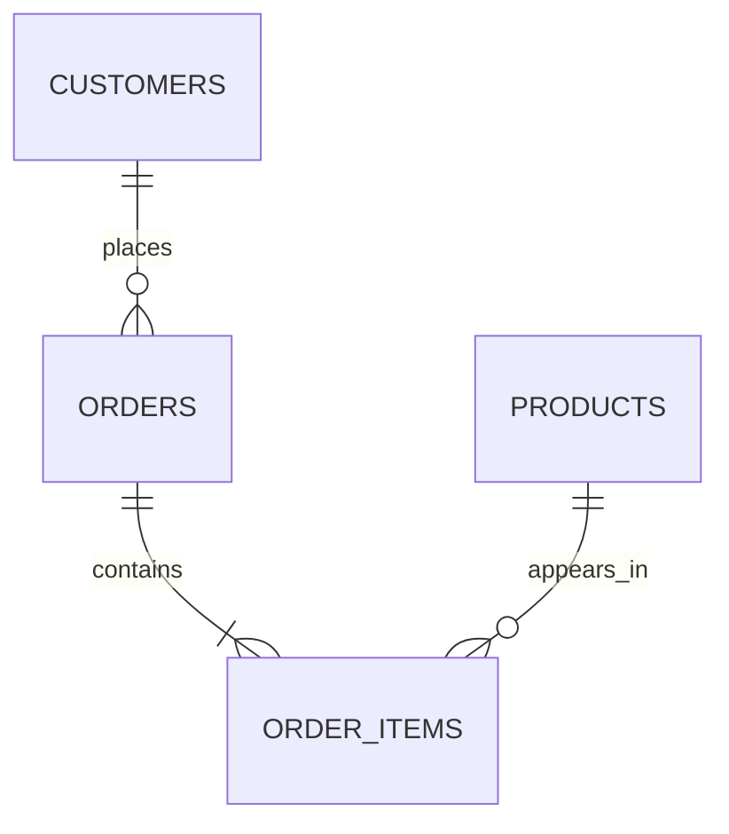

# SQL Practice Database

This database is designed to be reused while learning SQL.

Start with simple `SELECT` queries, then keep using the same tables as you learn:

`WHERE` → `ORDER BY` → aggregates → `GROUP BY` → `JOIN` → subqueries

## Files

- `sql-practice.db` — SQLite practice database
- `01-select-practice.sql` — first exercises, with no answers included

## Database Structure



## Tables

### `customers`

| Column | Meaning |
|---|---|
| `customer_id` | Unique customer ID |
| `first_name` | Customer first name |
| `last_name` | Customer last name |
| `email` | Customer email |
| `city` | Customer city |
| `country` | Customer country |
| `signup_date` | Date the customer joined |

**Rows:** 25

### `products`

| Column | Meaning |
|---|---|
| `product_id` | Unique product ID |
| `product_name` | Product name |
| `category` | Product category |
| `price` | Current product price |

**Rows:** 20

### `orders`

| Column | Meaning |
|---|---|
| `order_id` | Unique order ID |
| `customer_id` | Customer who placed the order |
| `order_date` | Date of the order |
| `status` | Current order status |

**Rows:** 40

### `order_items`

| Column | Meaning |
|---|---|
| `order_item_id` | Unique line-item ID |
| `order_id` | Order containing this item |
| `product_id` | Product purchased |
| `quantity` | Number purchased |
| `unit_price` | Price per unit at time of purchase |

**Rows:** 64

## How the Tables Relate

```text
customers
    |
    | customer_id
    v
orders
    |
    | order_id
    v
order_items
    ^
    | product_id
    |
products
```

You do **not** need to understand all of these relationships yet.

For the first `SELECT` lesson, simply practise retrieving columns from individual tables.

## Recommended Repo Placement

```text
sql-learning-lab/
├── databases/
│   └── sql-practice.db
├── practice/
│   └── 01-select-practice.sql
└── notes/
    └── ...
```

## Learning Rule

When the course introduces a new SQL feature:

1. Learn what it means.
2. Make a short note.
3. Use it against this database.
4. Try a few questions without looking at the syntax.
5. Keep moving once you can explain and use it.

The goal is not to memorise every query. The goal is to become comfortable turning a question into SQL.
