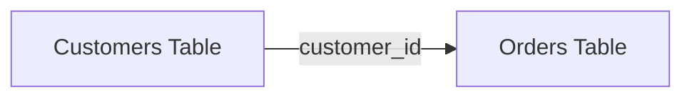
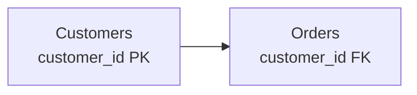
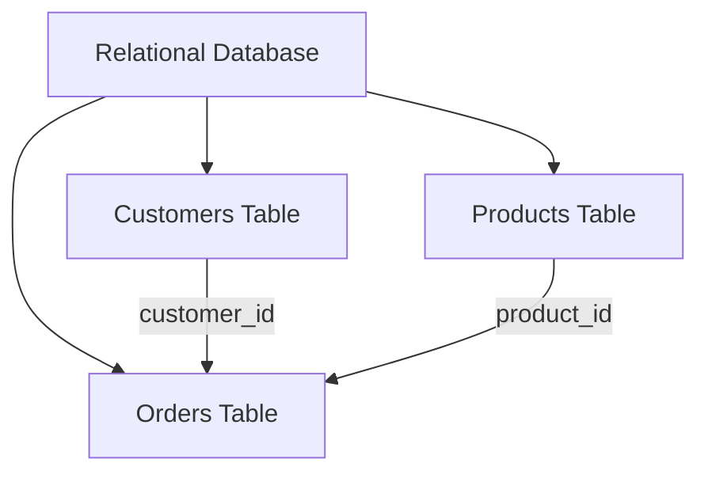

# What is SQL?

SQL stands for **Structured Query Language**.

It is the language used to **communicate with a database**.

## What SQL is used for

SQL helps you work with data stored in a database.  
You can use it to:

1. **Read and retrieve data**
2. **Filter data**
3. **Sort data**
4. **Add new data**
5. **Update existing data**
6. **Delete data**

## Key idea

SQL is a **non-procedural (declarative)** language.

That means you usually tell the database **what you want**, not every step for **how to do it**.

For example:

- You say: **"Give me all customers from London"**
- You do **not** need to explain how the database should search through every row

---

## Flow Diagram: How SQL Works


---

## Relational Databases

A **relational database** stores data in structured **tables**.

Tables contain:

- **Columns** → describe the type of data
- **Rows** → contain individual records

Different tables can be connected, or **related**, using matching values.

### Example

A customer table might contain:

| customer_id | name |
|---|---|
| 1 | Morgan |
| 2 | Rose |

An orders table might contain:

| order_id | customer_id | total |
|---|---|---|
| 101 | 1 | 45.00 |
| 102 | 1 | 20.00 |
| 103 | 2 | 75.00 |

The `customer_id` column connects the two tables.



This allows the database to understand:

> Customer 1 placed Orders 101 and 102.

---

## Keys

Relationships between tables are usually created using **keys**.

### Primary Key

A **primary key** uniquely identifies each row in a table.

Example:

```text
customer_id
```

Each customer should have a different `customer_id`.

### Foreign Key

A **foreign key** stores a value that points to a primary key in another table.

For example:

```text
Customers.customer_id
```

is the primary key.

And:

```text
Orders.customer_id
```

can be a foreign key referencing it.



`PK` = Primary Key  
`FK` = Foreign Key

---

## Why Use Relationships?

Relationships help avoid repeating the same information.

Instead of storing:

```text
order_id | customer_name | customer_email | customer_address
```

for every order, customer information can be stored once in a `Customers` table.

The `Orders` table only needs the customer's ID.

This helps:

- reduce duplicated data
- keep data organised
- make updates easier
- improve data consistency
- connect information across multiple tables

---

## Relational Database Structure



A relational database can therefore contain many tables that work together.

---

# NoSQL

**NoSQL** commonly means **Not Only SQL**.

NoSQL databases are designed for data that does not always fit neatly into traditional relational tables.

They may store data as:

- documents
- key-value pairs
- graphs
- wide-column structures

rather than only rows and columns.

---

## Relational vs NoSQL

### Relational Database

Usually structured like:

```text
Database
   ↓
Tables
   ↓
Rows + Columns
   ↓
Relationships
```

Example technologies:

- PostgreSQL
- MySQL
- SQLite
- Microsoft SQL Server

### NoSQL Database

Can use different structures:

```text
Database
   ↓
Documents / Key-Value / Graph / Other Structures
```

Example technologies:

- MongoDB
- Redis
- Cassandra
- Neo4j

---

## Simple Comparison

| Relational Database | NoSQL Database |
|---|---|
| Data stored mainly in tables | Data can use several structures |
| Rows and columns | Documents, graphs, key-value pairs, etc. |
| Tables can be related | Relationships may be represented differently |
| Usually queried with SQL | Query method depends on the database |
| Good for structured data | Useful for flexible or changing data structures |

---

## Quick Mental Model

```text
Relational database
=
structured tables
+
relationships between tables
+
SQL
```

Whereas:

```text
NoSQL
=
more flexible ways of organising data
```


