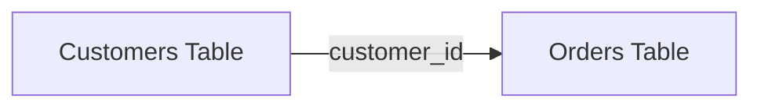
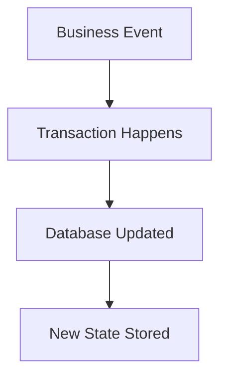
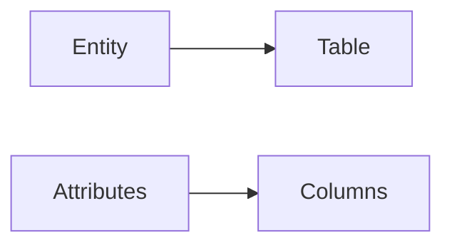
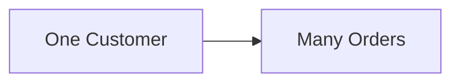
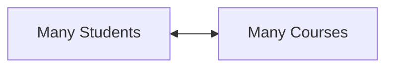
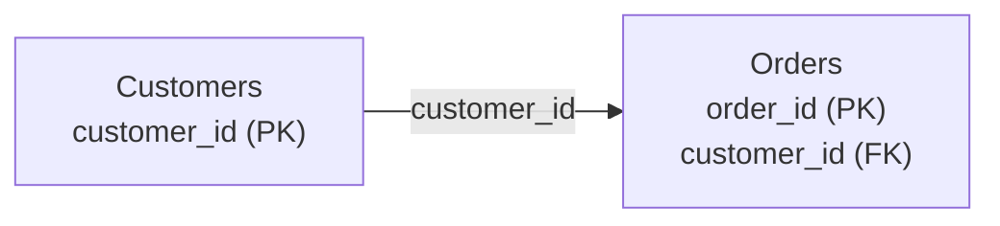
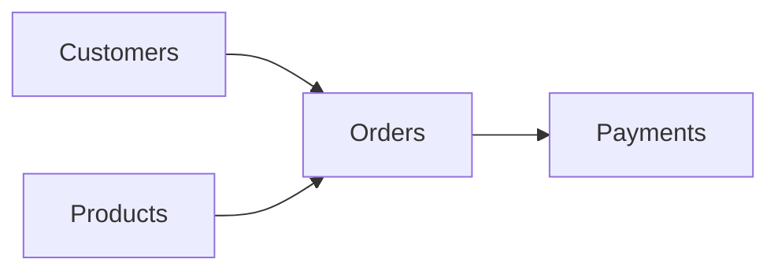
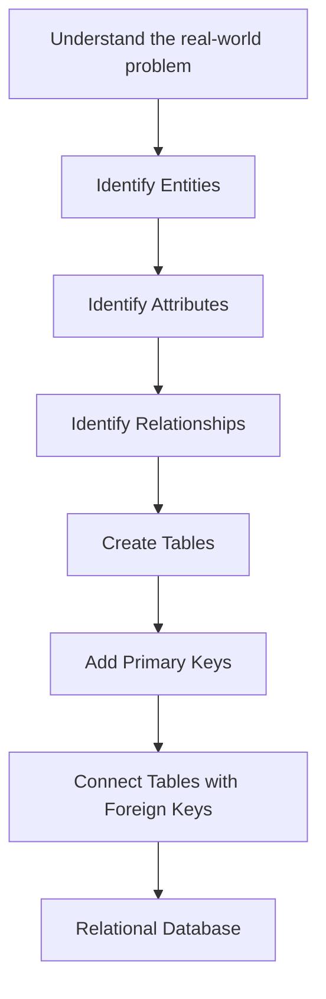

# Relational Models, Transactions, and ER Diagrams

This section introduces how databases are designed and how different pieces of data relate to each other.

---

## Relational Model

A **relational model** organises data into tables.

Each table contains:

- **Rows** → individual records
- **Columns** → attributes or properties of those records

Different tables can be connected using shared values such as IDs.

### Example

```text
Customers
customer_id | name
------------|--------
1           | Morgan
2           | Rose
```

```text
Orders
order_id | customer_id | total
---------|-------------|------
101      | 1           | 45.00
102      | 1           | 20.00
103      | 2           | 75.00
```

The `customer_id` column connects the two tables.



This relationship allows us to answer questions such as:

> Which orders belong to a particular customer?

---

## Transactional Model

A **transactional database** is mainly used to record things that are happening during normal business activity.

Examples include:

- a customer placing an order
- a payment being made
- money being transferred
- an insurance claim being submitted
- stock being added or removed

A transaction usually changes data in the database.



### Example

```text
Customer buys an item
        ↓
Order is created
        ↓
Payment is recorded
        ↓
Stock is reduced
        ↓
Database is updated
```

> A database can be both **relational** and **transactional**.

They describe different things:

| Term | Meaning |
|---|---|
| Relational | How the data is organised |
| Transactional | What the database is being used for |

---

# Data Model Building Blocks

When designing a database, three important ideas are:

- **Entity**
- **Attribute**
- **Relationship**

---

## Entity

An **entity** is a person, place, thing, or event that we want to store information about.

Examples:

- Customer
- Employee
- Product
- Order
- Account
- Vehicle

A useful way to remember it:

> An entity is usually a **noun**.

In a relational database, an entity often becomes a **table**.

```text
Entity
  ↓
Customer
  ↓
Customers Table
```

---

## Attribute

An **attribute** is a characteristic or property of an entity.

For example:

```text
Customer
├── customer_id
├── first_name
├── last_name
├── email
└── city
```

Here:

```text
Entity = Customer
```

and:

```text
Attributes =
customer_id
first_name
last_name
email
city
```

In a relational database, attributes often become **columns**.



---

## Relationship

A **relationship** describes how two entities are connected.

Examples:

```text
Customer → places → Order
```

```text
Employee → works in → Department
```

```text
Student → enrols in → Course
```

There are three common types of relationship.

---

# One-to-One Relationship

A **one-to-one** relationship means one record is linked to one other record.

Example:

```text
Person ───── Passport
   1             1
```

Simplified idea:

> One person has one passport, and one passport belongs to one person.


---

# One-to-Many Relationship

A **one-to-many** relationship means one record can be connected to many records in another table.

Example:

> One customer can place many orders.

```text
Customer
   │
   ├── Order 101
   ├── Order 102
   └── Order 103
```



This type of relationship is very common in databases.

---

# Many-to-Many Relationship

A **many-to-many** relationship means many records on one side can connect to many records on the other side.

Example:

> Many students can take many courses.

```text
Students ←────→ Courses
```

A student may take:

```text
Student A
├── SQL
├── Python
└── Statistics
```

and one course may contain:

```text
SQL Course
├── Student A
├── Student B
├── Student C
└── Student D
```



In a relational database, many-to-many relationships are usually handled using an extra table between them.


You do not need to understand the middle table in detail yet.

---

# Primary Keys

A **primary key** uniquely identifies each row in a table.

Example:

```text
Customers
----------------
customer_id   PK
name
email
```

Each customer should have a unique `customer_id`.

A primary key should allow us to identify one specific record.

```text
customer_id = 1
```

could identify exactly one customer.

---

# Foreign Keys

A **foreign key** is a column that refers to a primary key in another table.

Example:

```text
Customers
----------------
customer_id   PK
name
```

```text
Orders
----------------
order_id      PK
customer_id   FK
total
```

The `customer_id` inside `Orders` tells us which customer made the order.



### Quick meaning

```text
PK = Primary Key
FK = Foreign Key
```

---

# ER Diagrams

**ER** stands for:

> **Entity Relationship**

An **ER diagram** is a visual representation of a database.

It shows:

- entities
- attributes
- tables
- primary keys
- foreign keys
- relationships between tables

Think of an ER diagram as:

> A blueprint of the database.

---

## Simple ER Diagram



This helps us quickly understand how different parts of the database connect.

A real ER diagram normally contains more detail, including:

- column names
- data types
- primary keys
- foreign keys
- relationship symbols

---

# Database Design Process

A simple way to think about database design is:



---

# Quick Mental Model

```text
Entity
= thing we store data about
= often becomes a table

Attribute
= information describing an entity
= often becomes a column

Relationship
= how entities connect

Primary Key
= uniquely identifies a row

Foreign Key
= connects a table to another table

ER Diagram
= visual map of the database
```

---

# Relational vs Transactional

Do not think of these as opposites.

```text
Relational
= structure of the data
```

```text
Transactional
= purpose or workload of the database
```

A system can be:

```text
Relational
+
Transactional
```

at the same time.

---

## Quick Summary

| Concept | Simple Meaning |
|---|---|
| Relational Model | Data organised into related tables |
| Transaction | A business event that changes data |
| Entity | A thing we store information about |
| Attribute | A property of that thing |
| Relationship | How two entities connect |
| Primary Key | Unique ID for a row |
| Foreign Key | Link to another table |
| ER Diagram | Visual blueprint of the database |