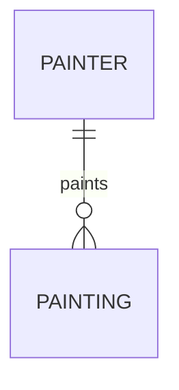
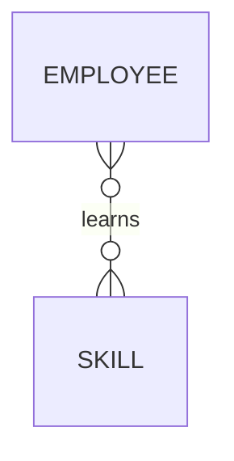
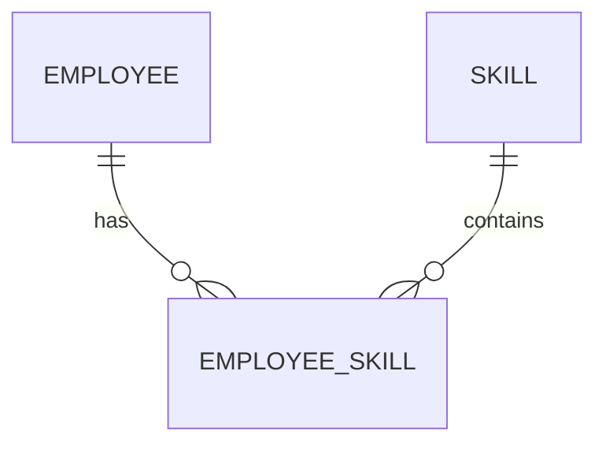
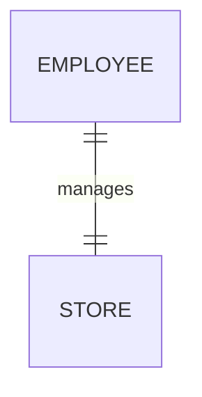

# ER Diagram Notation

An **ER Diagram (Entity Relationship Diagram)** visually shows:

- the entities/tables in a database
- how those entities are related
- the type of relationship between them

Different diagram styles can represent the same relationship.

Three common styles are:

1. **Chen Notation**
2. **Crow's Foot Notation**
3. **UML Class Diagram Notation**

---

# Cardinality

Before looking at the different notation styles, it helps to understand **cardinality**.

Cardinality describes:

> How many records from one entity can be related to records in another entity?

The three common relationships are:

| Relationship | Meaning |
|---|---|
| One-to-One | One record relates to one record |
| One-to-Many | One record relates to many records |
| Many-to-Many | Many records relate to many records |

---

# One-to-Many Relationship

Example:

> One painter can paint many paintings.  
> Each painting is painted by one painter.

```text
PAINTER  1 ───────── M  PAINTING
```

This means:

```text
One Painter
    │
    ├── Painting 1
    ├── Painting 2
    └── Painting 3
```

## Mermaid ER Diagram



The important idea is:

```text
PAINTER
   1
   │
   │
   many
   ↓
PAINTING
```

This is one of the most common relationships in relational databases.

---

# Many-to-Many Relationship

Example:

> One employee can learn many skills.  
> One skill can be learned by many employees.

```text
EMPLOYEE  M ───────── N  SKILL
```

For example:

```text
Employee A
├── SQL
├── Python
└── Excel

Employee B
├── SQL
└── Excel
```

At the same time:

```text
SQL
├── Employee A
├── Employee B
├── Employee C
└── Employee D
```

So both sides can contain many relationships.

## Mermaid ER Diagram



In an actual relational database, many-to-many relationships are usually implemented using a third table.

For example:



This might become:

```text
EMPLOYEE
     ↓
EMPLOYEE_SKILL
     ↓
SKILL
```

The middle table connects the other two tables.

---

# One-to-One Relationship

Example:

> One employee manages one store.  
> Each store is managed by one employee.

```text
EMPLOYEE  1 ───────── 1  STORE
```

## Mermaid ER Diagram



This means:

```text
Employee A ───── Store A

Employee B ───── Store B
```

Each record is related to only one record on the other side.

---

# Chen Notation

**Chen notation** represents entities using rectangles and relationships using diamonds.

A one-to-many relationship might look conceptually like:

```text
┌─────────┐        ◇ paints ◇        ┌──────────┐
│ PAINTER │  1 ─────────────── M     │ PAINTING │
└─────────┘                           └──────────┘
```

The letters/numbers describe the relationship:

```text
1 = One
M = Many
N = Many
```

So:

```text
1:M
```

means:

> One-to-Many

and:

```text
M:N
```

means:

> Many-to-Many

---

# Crow's Foot Notation

Crow's Foot notation uses symbols at the ends of relationship lines.

It is called **Crow's Foot** because the symbol for "many" looks like a bird's foot.

Conceptually:

```text
One            Many

 |               <
 |──────────────<
 |               <
```

The forked end means:

> Many

while a line represents:

> One

---

## Common Crow's Foot Symbols

| Symbol idea | Meaning |
|---|---|
| `|` | One |
| Crow's foot | Many |
| `O` | Zero / optional |
| `||` | Exactly one |
| `O|` | Zero or one |
| `O<` | Zero or many |
| `|<` | One or many |

The exact graphical appearance depends on the diagram software being used.

---

# Optionality

Crow's Foot notation can describe more than just **one** or **many**.

It can also show whether a relationship is **optional**.

For example:

```text
Zero or many
```

means something might have:

```text
0
1
2
3
...
```

related records.

Whereas:

```text
One or many
```

means it must have:

```text
1
2
3
...
```

related records.

This distinction becomes important when defining the business rules of a database.

---

# UML Notation

**UML** uses number ranges to describe relationships.

For example:

```text
1..1
```

means:

> Minimum 1, maximum 1.

So exactly one.

---

```text
1..*
```

means:

> Minimum 1, maximum many.

The `*` means many.

---

```text
0..*
```

means:

> Zero or many.

---

```text
0..1
```

means:

> Zero or one.

---

## UML Quick Reference

| UML | Meaning |
|---|---|
| `1..1` | Exactly one |
| `0..1` | Zero or one |
| `1..*` | One or many |
| `0..*` | Zero or many |

---

# Same Relationship, Different Notation

All three styles can describe the same database relationship.

For example:

> One painter can paint many paintings.

### Chen

```text
PAINTER  1 ─── paints ─── M  PAINTING
```

### Crow's Foot


### UML

```text
PAINTER                  PAINTING
   1..1  ─── paints ───   0..*
```

They look different, but they are describing the same basic relationship.

---

# Why Learn Different Notations?

Different:

- companies
- database tools
- textbooks
- courses
- software

may use different ER diagram styles.

You do not need to become an expert in every notation.

The important skill is being able to recognise:

```text
What are the entities?
        ↓
How are they connected?
        ↓
Is the relationship one-to-one,
one-to-many,
or many-to-many?
```

---

# Quick Mental Model

```text
1:1
One-to-One

Employee ───── Store
```

```text
1:M
One-to-Many

Customer ─────< Orders
```

```text
M:N
Many-to-Many

Employees >────< Skills
```

---

# Key Takeaway

Do not focus too much on memorising the appearance of every diagram style.

Focus first on understanding the relationship:

```text
1 : 1
one ↔ one

1 : M
one ↔ many

M : N
many ↔ many
```

Once you understand the relationship itself, learning how Chen, Crow's Foot, or UML represents it becomes much easier.