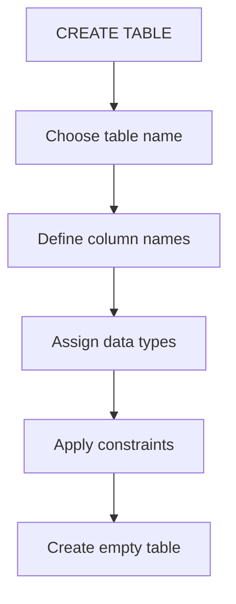
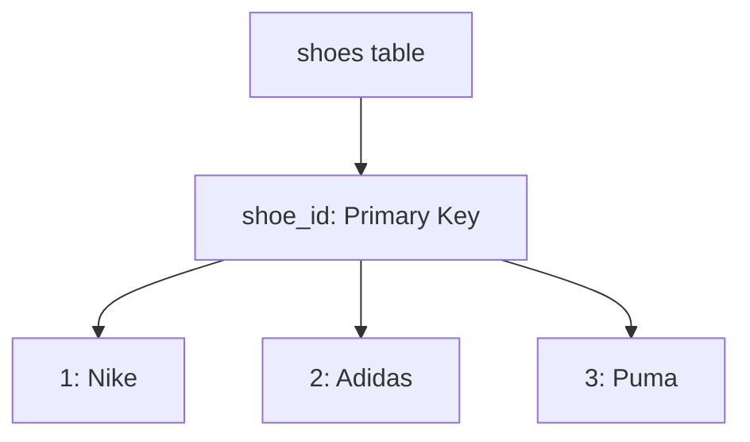
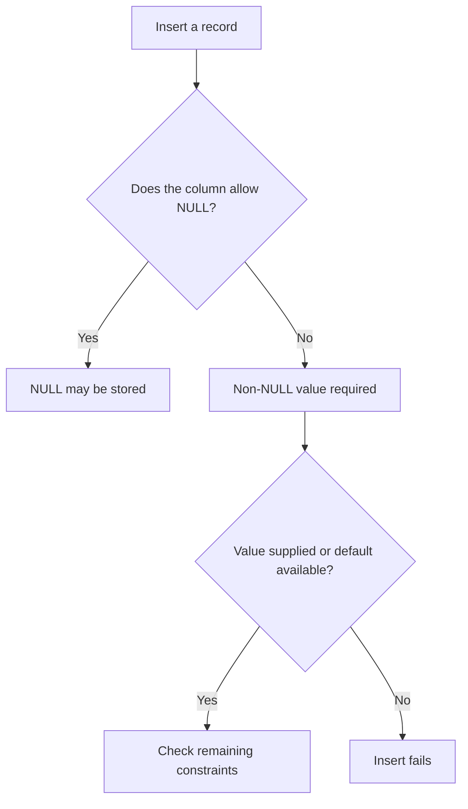
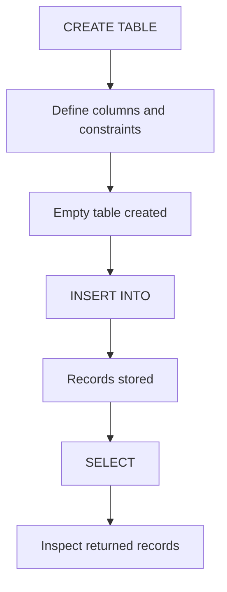

# Creating Tables and Inserting Data

SQL allows us to create tables, define the information they should contain, and insert records into them.

This section covers:

- Creating tables using `CREATE TABLE`
- Defining columns and data types
- Understanding `PRIMARY KEY`
- Understanding `NULL` and `NOT NULL`
- Adding records using `INSERT INTO`
- Retrieving inserted records using `SELECT`

---

## 1. CREATE TABLE

`CREATE TABLE` creates a new table inside a database.

When creating a table, we define:

1. The table name.
2. The column names.
3. The data type for each column.
4. Any rules or constraints on the data.

### Basic Syntax

```sql
CREATE TABLE table_name (
    column_1 DATA_TYPE CONSTRAINT,
    column_2 DATA_TYPE CONSTRAINT,
    column_3 DATA_TYPE
);
```

### Example: Creating a Shoes Table

```sql
CREATE TABLE shoes (
    shoe_id INTEGER PRIMARY KEY,
    brand TEXT NOT NULL,
    shoe_type TEXT NOT NULL,
    colour TEXT NOT NULL,
    price REAL NOT NULL,
    description TEXT
);
```

This creates a table called `shoes` containing six columns.

**Important:** Creating a table defines its structure. It does not automatically insert any records.

### How CREATE TABLE Works



---

## 2. SQL Data Types

Data types describe the kind of data a column is intended to store.

### Common SQLite Data Types

| Data Type | Purpose | Example |
|---|---|---|
| `INTEGER` | Whole numbers | `25` |
| `REAL` | Numbers with decimal values | `49.99` |
| `TEXT` | Text and characters | `'Nike'` |
| `BLOB` | Binary data | Images or other binary content |

SQLite also has a `NULL` storage class, which represents a missing or unknown value.

### Other Types Shown in the Course

| Data Type | Meaning |
|---|---|
| `CHAR(10)` | Character data with a declared length of 10 |
| `VARCHAR(250)` | Variable-length character data with a declared maximum of 250 |
| `DECIMAL(8,2)` | Decimal number with 8 digits total, including 2 after the decimal point |

For example:

```sql
price DECIMAL(8,2)
```

In database systems that enforce this declaration, it represents a decimal number with up to six digits before the decimal point and two digits after it.

**SQLite note:** SQLite uses a flexible type system. It does not enforce the length limits in `CHAR(10)` or `VARCHAR(250)`, and `DECIMAL(8,2)` does not automatically enforce fixed decimal precision.

For beginner SQLite exercises, using `TEXT`, `INTEGER`, and `REAL` keeps things simple.

For financial applications requiring exact monetary values, storing amounts as integer minor units (such as pence) is another common approach.

---

## 3. Primary Keys

A `PRIMARY KEY` uniquely identifies each record in a table.

For example, consider a table containing three products:

| shoe_id | brand | colour |
|---|---|---|
| 1 | Nike | Black |
| 2 | Adidas | White |
| 3 | Puma | Blue |

Each `shoe_id` identifies one specific record.

### Creating a Primary Key

```sql
CREATE TABLE shoes (
    shoe_id INTEGER PRIMARY KEY,
    brand TEXT NOT NULL
);
```

### Important Rules

- Primary key values must be unique.
- Duplicate primary key values are not permitted.
- Primary keys are intended to identify individual records.
- Primary keys should not contain `NULL` values.

**SQLite note:** `INTEGER PRIMARY KEY` is a convenient choice because SQLite automatically assigns a unique integer when the value is omitted or explicitly supplied as `NULL`.

SQLite also has a historical exception that can allow `NULL` in certain non-integer primary keys. Explicitly using `NOT NULL` avoids this behaviour when defining those keys.

### Visual Example



Each record has its own unique identifier.

---

## 4. NULL and NOT NULL

`NULL` represents missing or unknown information.

`NOT NULL` is a constraint that requires a column to contain a non-NULL value.

### NOT NULL Example

```sql
CREATE TABLE shoes (
    shoe_id INTEGER PRIMARY KEY,
    brand TEXT NOT NULL
);
```

The `brand` column cannot contain `NULL`.

Attempting to insert a record with a NULL brand will result in an error.

### Allowing NULL

```sql
CREATE TABLE shoes (
    shoe_id INTEGER PRIMARY KEY,
    description TEXT
);
```

The `description` column is optional because it does not have a `NOT NULL` constraint.

A column normally allows NULL unless another constraint or database rule prevents it.

### NULL vs Empty String

These values are not the same:

| Value | Meaning |
|---|---|
| `NULL` | Missing or unknown information |
| `''` | An empty string containing no characters |
| `0` | A numeric value equal to zero |

For example:

```sql
NULL
```

Means the information is missing or unknown.

Whereas:

```sql
''
```

Means an empty text value has been supplied.

### Mental Model



---

## 5. INSERT INTO

`INSERT INTO` adds new records to an existing table.

Remember:

- `CREATE TABLE` defines the structure.
- `INSERT INTO` adds records to that structure.

### Basic Syntax

```sql
INSERT INTO table_name (
    column_1,
    column_2
)
VALUES (
    value_1,
    value_2
);
```

The values must correspond to the columns listed in the statement.

### Example: Adding a Shoe

Assume the `shoes` table has already been created.

```sql
INSERT INTO shoes (
    shoe_id,
    brand,
    shoe_type,
    colour,
    price,
    description
)
VALUES (
    1,
    'Nike',
    'Trainers',
    'Black',
    79.99,
    NULL
);
```

This adds one record to the table.

The result would look like:

| shoe_id | brand | shoe_type | colour | price | description |
|---|---|---|---|---|---|
| 1 | Nike | Trainers | Black | 79.99 | NULL |

### Important Rules

- Text values are normally enclosed in single quotes: `'Nike'`.
- Numeric values can be written without quotes: `79.99`.
- `NULL` is written without quotes.
- Values are separated using commas.
- The values must match the columns listed in the statement.

---

## 6. Inserting Without Listing Column Names

You can also insert records without explicitly listing the column names.

Example:

```sql
INSERT INTO shoes
VALUES (
    2,
    'Adidas',
    'Running',
    'White',
    89.99,
    NULL
);
```

This works when the values match the table's column order and number.

However, explicitly listing the column names is generally clearer and helps avoid mistakes.

### Recommended Approach

```sql
INSERT INTO shoes (
    shoe_id,
    brand,
    shoe_type,
    colour,
    price,
    description
)
VALUES (
    2,
    'Adidas',
    'Running',
    'White',
    89.99,
    NULL
);
```

This is easier to read because you can see which value belongs to each column.

---

## 7. Checking Inserted Data

After inserting records, use `SELECT` to retrieve the data and check that it was stored correctly.

```sql
SELECT *
FROM shoes;
```

This retrieves all columns and rows from the `shoes` table.

You can also retrieve specific columns:

```sql
SELECT
    brand,
    shoe_type,
    price
FROM shoes;
```

### Complete Workflow



---

## 8. Quick Reference

| SQL Keyword | Purpose |
|---|---|
| `CREATE TABLE` | Create a new table |
| `INTEGER` | Whole-number data type |
| `TEXT` | Text data type |
| `REAL` | Numeric type that can contain decimal values |
| `PRIMARY KEY` | Uniquely identify each record |
| `NOT NULL` | Require a non-NULL value |
| `NULL` | Represent missing or unknown information |
| `INSERT INTO` | Add records to a table |
| `VALUES` | Supply the values being inserted |
| `SELECT` | Retrieve records from a table |

### Remember

```text
CREATE TABLE
    ↓
Define the table structure
    ↓
INSERT INTO
    ↓
Add records
    ↓
SELECT
    ↓
Retrieve and check records
```

**Key takeaway:** `CREATE TABLE` defines where and how data will be stored, `INSERT INTO` adds the records, and `SELECT` retrieves them.

---

# Temporary Tables

A **temporary table** is a table that exists only for the current database session or connection.

When the connection is closed, the temporary table is removed automatically.

Temporary tables are useful when:

- working with intermediate results
- breaking a complex query into smaller steps
- working with filtered subsets of data
- preparing data before a larger query
- experimenting without permanently changing the database

---

## Normal Table vs Temporary Table

| Normal Table | Temporary Table |
|---|---|
| Stored permanently | Exists only for the current session |
| Remains after reconnecting | Disappears after the connection ends |
| Useful for long-term data | Useful for temporary/intermediate work |
| Created with `CREATE TABLE` | Created with `CREATE TEMP TABLE` |

---

## Basic Syntax

In SQLite:

```sql
CREATE TEMP TABLE table_name (
    column_1 DATA_TYPE,
    column_2 DATA_TYPE
);
```

`TEMP` and `TEMPORARY` both mean the same thing in SQLite.

For example:

```sql
CREATE TEMP TABLE practice_temp (
    id INTEGER,
    name TEXT
);
```

---

# Creating a Temporary Table From a Query

A temporary table can also be created using the results of a `SELECT` query.

The basic pattern is:

```sql
CREATE TEMP TABLE new_table AS
SELECT columns
FROM existing_table;
```

Example:

```sql
CREATE TEMP TABLE cheap_products AS
SELECT
    product_name,
    price
FROM products
WHERE price < 50;
```

This creates a temporary table containing only products priced below 50.

---

## How It Works


The original table is not changed.

The temporary table contains the result of the query.

---

# Example

Suppose the `products` table contains:

| product_name | price |
|---|---:|
| Mouse | 24.99 |
| Monitor | 219.99 |
| Desk Mat | 22.99 |

Running:

```sql
CREATE TEMP TABLE cheap_products AS
SELECT
    product_name,
    price
FROM products
WHERE price < 50;
```

creates:

| product_name | price |
|---|---:|
| Mouse | 24.99 |
| Desk Mat | 22.99 |

You can then query the temporary table normally:

```sql
SELECT *
FROM cheap_products;
```

---

# Temporary Table Lifetime

A temporary table exists only while the current database connection remains open.

```text
Connect to database
        ↓
Create temporary table
        ↓
Use temporary table
        ↓
Close connection
        ↓
Temporary table disappears
```

If you reconnect later, the temporary table will no longer exist.

---

# Why Use Temporary Tables?

Temporary tables can make larger pieces of work easier to understand.

Instead of writing one very large query:

```text
large query
    ↓
filter
    ↓
join
    ↓
calculate
    ↓
aggregate
```

you can sometimes break the work into smaller stages:

```text
original data
    ↓
temporary table
    ↓
additional analysis
    ↓
final result
```

This can make complex analysis easier to inspect and debug.

---

# SQLite Syntax Note

For SQLite, write:

```sql
CREATE TEMP TABLE sandals AS
SELECT *
FROM shoes
WHERE shoe_type = 'sandals';
```

You do not need parentheses around the `SELECT` statement.

---

# Quick Reference

| Syntax | Meaning |
|---|---|
| `CREATE TABLE` | Create a permanent table |
| `CREATE TEMP TABLE` | Create a temporary table |
| `CREATE TEMPORARY TABLE` | Same as `CREATE TEMP TABLE` |
| `AS SELECT` | Create a table from query results |

---

## Mental Model

```text
Permanent table
= keep this data

Temporary table
= I only need this while I am working
```